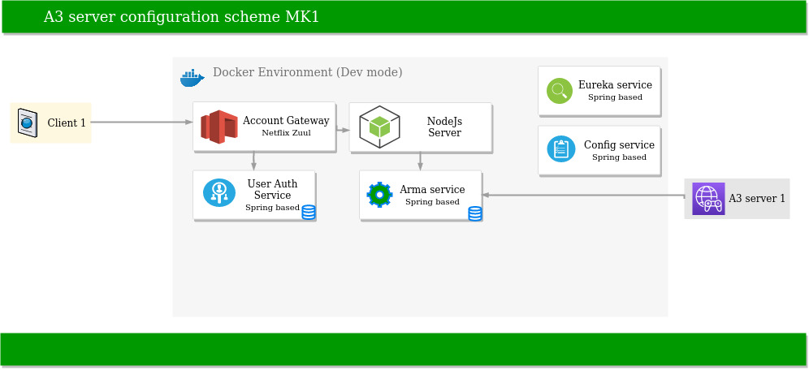

# A3-Web-Config-Manager

Web config manager was born from an idea to influence a virtual world from a real one. The idea itself is not new originally
but its potential remains high. It happens so because new variations of gameplay can be invented that can bring 
a typical game on a new level.

The concept has one purpose: to prove a theory when real world data can change ingame experience of each player. 

Trello board: https://trello.com/b/xGp7I8bx/a3-web-configurator

## Description
Current server's concept approximately looks: 

## Technical Stack
Not yet ready

## How To Run
Not yet ready

## Testing
Not yet ready

## License
MIT